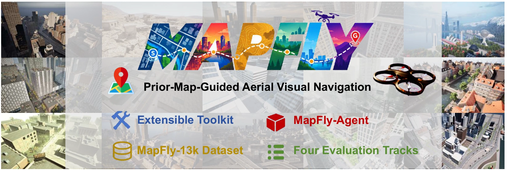

# MapFly

[](https://GuYan66.github.io/MapFly/)
[](https://huggingface.co/datasets/EzGuYan/MapFly)
[](https://huggingface.co/datasets/EzGuYan/MapFly_DataGen)

## Introduction

MapFly is a benchmark for prior-map-guided aerial visual navigation: a UAV flies from a first-person view and an annotated 2D map that marks the goal, without route instructions or a language description of the target. This repository is the toolkit (task construction, data collection, map rendering, closed-loop evaluation). MapFly-13K, Linux UE packages, scene bundles, and MapFly-Agent are linked above.



Four evaluation tracks cross static / live position cues (P0 / P1) with route-free / route-assisted maps (R0 / R1):

| Track | Map shows | `--track` |
|---|---|---|
| P0-R0 | static start and goal | `P0-R0` |
| P1-R0 | live position and goal | `P1-R0` (default) |
| P0-R1 | static start, goal and the expert route | `P0-R1` |
| P1-R1 | live position, goal and the remaining route | `P1-R1` |

## Table of Contents

1. [Prerequisites](#prerequisites)
2. [Installation](#installation)
3. [Downloads](#downloads)
4. [Evaluation](#evaluation)
5. [MapFly-Agent](#mapfly-agent)
6. [Data generation](#data-generation)
7. [Citation](#citation)
8. [License](#license)

## Prerequisites

- Linux (Unreal Engine will not run as root)
- Python 3.10+
- NVIDIA GPU
- `7z` for the split episode archives

## Installation

### Step 1: Clone

```bash
git clone https://github.com/GuYan66/MapFly.git
cd MapFly
```

### Step 2: Python environment

```bash
python -m venv .venv && source .venv/bin/activate
pip install -e ".[dev]"
cp configs/local.example.yaml configs/local.yaml
```

If you must run as root, wrap commands with `scripts/run_as_mapfly.sh '<command>'`.

## Downloads

All Hugging Face archives unzip into the checkout. `configs/local.yaml` points
`dataset_root` at the episodes and `scene_bundles_root` at the bundles. Closed-loop
eval loads the bundle even for OSM maps.

1. **MapFly-13K** — [EzGuYan/MapFly](https://huggingface.co/datasets/EzGuYan/MapFly) `original_data/`

   Split zips per scene. Unpack into `data/mapfly13k/`:

   ```bash
   7z x original_data/smallcity.zip -o data/mapfly13k
   ```

2. **UE packages** — [EzGuYan/MapFly_DataGen](https://huggingface.co/datasets/EzGuYan/MapFly_DataGen) `ue/`

   ```bash
   unzip ue/smallcity.zip -d assets/ue
   ```

3. **Scene bundles** — same repo, `bundles/`

   ```bash
   unzip bundles/smallcity.zip -d SceneBundles
   ```

4. **MapFly-Agent (OFT)** — [EzGuYan/MapFly-Agent](https://huggingface.co/EzGuYan/MapFly-Agent)

   See [starVLA/examples/uav/README.md](starVLA/examples/uav/README.md).

Layout after unzip, splits, and satellite / markers-only maps:
[docs/dataset.md](docs/dataset.md).

## Evaluation

Replay the expert route on a few Test Seen episodes (all should succeed):

```bash
python -m mapfly.eval --eval-scene smallcity --count 5
```

Your own policy implements `mapfly.eval.protocol.Policy`
([docs/policy_protocol.md](docs/policy_protocol.md)):

```bash
python -m mapfly.eval --policy my_package.my_policy:MyPolicy --eval-scene laketown --track P0-R0 --all
```

`--eval-scene` is that scene's part of `seen12_v1` (holdout if seen, all if unseen).
`--map-type satellite|markers_only` swaps the basemap. Metrics:
[docs/metrics.md](docs/metrics.md).

## MapFly-Agent

The released checkpoint is QwenOFT, P1-R0, 80k steps (Test Seen 86.6 / Test Unseen 62.7).
Setup, training and split eval: [starVLA/examples/uav/README.md](starVLA/examples/uav/README.md).

```bash
huggingface-cli download EzGuYan/MapFly-Agent mapfly_agent_oft_p1r0 \
  --local-dir starVLA/playground/Checkpoints/mapfly_agent_oft_p1r0
CKPT=starVLA/playground/Checkpoints/mapfly_agent_oft_p1r0/checkpoints/steps_80000_pytorch_model.pt \
  bash starVLA/examples/uav/eval_files/run_policy_server.sh
ROLE=unseen TAG=oft_p1r0 bash starVLA/examples/uav/eval_files/run_eval_split.sh
```

## Data generation

Same four phases as MapFly-13K. New scenes: [docs/new_scene.md](docs/new_scene.md).

```bash
python scripts/run_datagen.py --config configs/datagen.smoke.yaml --scene smallcity --count 5
python scripts/run_fly_validate.py --run data/smoke/smallcity --gpu 0
python scripts/run_capture.py --run data/smoke/smallcity --gpus 0
python scripts/render_episode_maps.py --run data/smoke/smallcity --map-type all
```

## Citation

```bibtex
@unpublished{mapfly,
  title = {MapFly: A Benchmark for Prior-Map-Guided Aerial Visual Navigation},
  author = {Anonymous Authors},
  note = {Manuscript under review},
  year = {2026}
}
```

## License

MIT ([LICENSE](LICENSE)). UE packages keep their Unreal / Marketplace licenses
and are for research use with this benchmark. The project website template is
CC BY-SA 4.0 ([website/TEMPLATE-NOTICE.md](website/TEMPLATE-NOTICE.md)).
